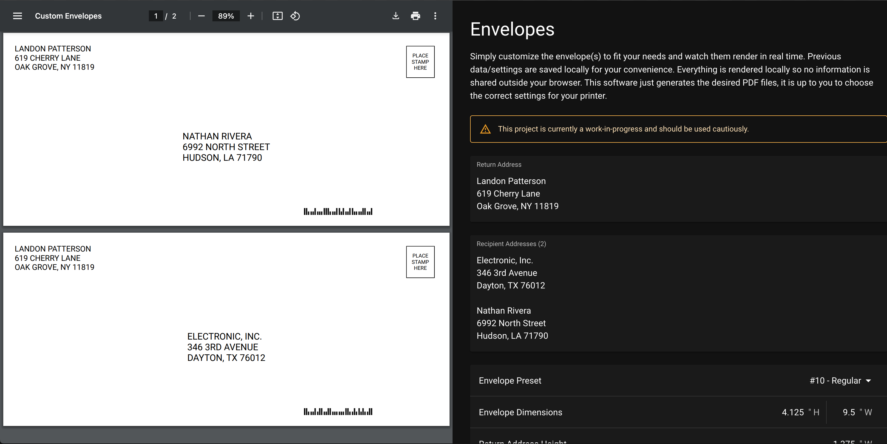

# Envelopes
> Online utility for generating envelopes in PDF format for printing

## About

This utility allows you to generate envelopes in PDF format for printing. Initially designed for printing Christmas card envelopes, it enables you to include a return address on each envelope and specify a list of recipient addresses separated by two newlines. Additionally, there are several customizable options available to suit your needs. Hosted on GitHub Pages, it is accessible at [envelopes.grigorian.org](https://envelopes.grigorian.org).

## References

https://pe.usps.com/Archive/NHTML/DMMArchive20170807/204.htm
https://pe.usps.com/text/pub28/28c2_002.htm
https://about.usps.com/publications/pub177/welcome.htm
